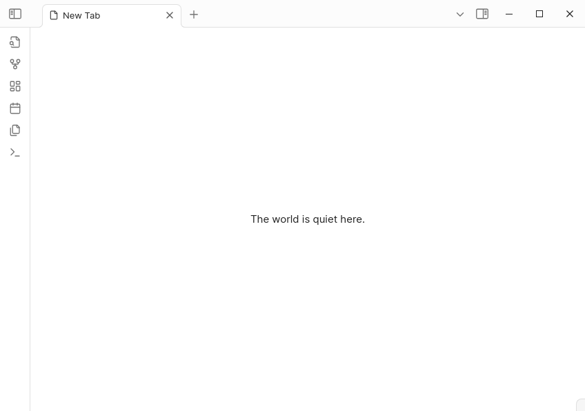

<dfn>Prologue</dfn> is an [Obsidian](https://obsidian.md) plugin that shows a random note, quote, or reminder each time you open a new tab.

## install

This plugin isn't on the community list yet. To try it, [download the latest release](https://github.com/joshavanier/prologue/releases) and unzip it into your vault’s `.obsidian/plugins` folder.

## setup

A sample collection.md will be created in your vault. Add items separated by onr or more blank lines, like this:

```markdown

> Slowness is beauty &mdash; Auguste Rodin

Drink water.

The Three Gates of Speech
1. Is it true?
2. Is it necessary?
3. Is it kind?
```

You can change the collection file in the plugin settings.

---

[avanier](https://avanier.dev)
